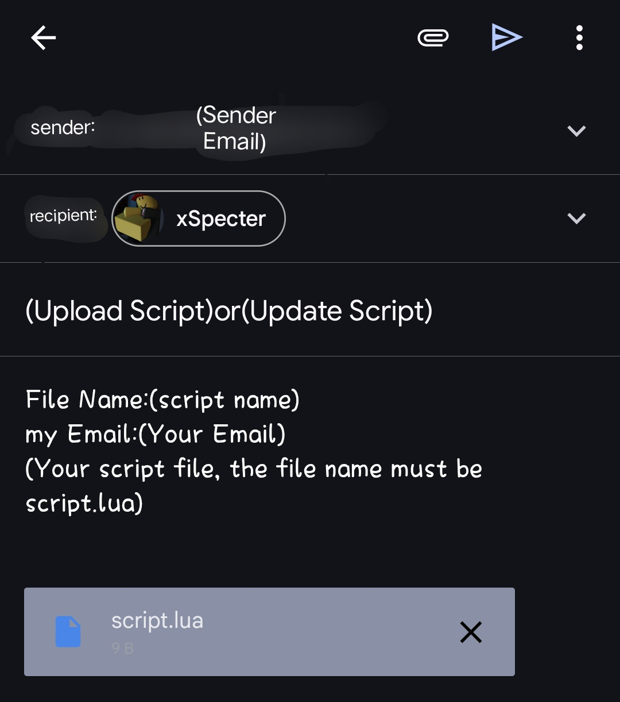

# xTitanium

**xTitanium** This is a [Lua script](https://en.m.wikipedia.org/wiki/Lua) placement that supports [Roblox](https://en.m.wikipedia.org/wiki/Roblox) only. Every script is uploaded to [scriptblox](https://scriptblox.com) for everyone to use freely.

---

# How to get the script
Method 1:  
In our [script](/script) folder you can find many scripts, you can copy or download them, but you can not edit or change them, if you edit them you will be violating the [MIT license](/LICENSE).  
  
Method 2:  
Find my account on [scriptblox](https://scriptblox.com/u/Tektronix). There are many scripts in it. You can copy them, but you cannot change or edit them, otherwise you will violate the [MIT license](/LICENSE) as in method 1.  

---

# Upload script or update script?  
Contact me at gmail, the following is the necessary format:  

Contact me:  
[coder4819@gmail.com](mailto:coder4819@gmail.com)

---

# xTitanium API  
Our API is stored in the [API folder](/API/script_api.lua). You can copy it and make it in your scripts, if you think my API script is missing something, you can edit or modify it, you will not violate the license content because of the MIT license.

How to use:  
Check out our examples:  
[Here](/API/script_examples.lua)

---

# Number of visits

